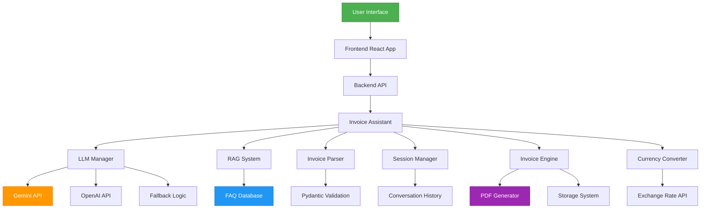

# AI-Powered E-Commerce Invoice Assistant

An intelligent invoice assistant that turns user input into structured invoices, validates missing fields, and suggests additions before final generation. Enhanced with advanced AI features, structured validation, memory, and business capabilities.

## 🌟 Key Features

### AI & Machine Learning
- **Real LLM Integration**: Uses Google Gemini for intelligent parsing and response generation
- **Structured Output Validation**: Pydantic models ensure data integrity with schema validation
- **RAG System**: Retrieval-Augmented Generation for FAQ responses
- **Multi-Model Fallback**: Automatic fallback between different LLM providers
- **Tool Calling**: Integrated tools for currency conversion, calculations, and more

### Memory & Context
- **Conversation History**: Maintains context across multiple interactions
- **Session Management**: Tracks conversation state and invoice drafts
- **Context-Aware Processing**: Remembers previous inputs for seamless experience

### Business Features
- **Professional PDF Generation**: Automatically creates branded invoice PDFs
- **Currency Conversion**: Real-time currency conversion with caching
- **Tax Calculations**: GST/VAT calculations with configurable rates
- **Invoice Storage**: Persistent storage with JSON backup

### Frontend Experience
- **Streaming Responses**: Real-time, typewriter-like response streaming
- **Modern UI**: React + Tailwind CSS with intuitive design
- **Interactive Catalog**: Browse and add products seamlessly
- **Real-time Cart**: Live cart updates and checkout flow

## 🏗️ Architecture



## 📁 Project Structure

```
CustomerCare-ChatBot/
├── api/                    # Vercel serverless API entrypoint
│   └── app.py
├── backend/                # Local Flask backend + core logic
│   ├── core/
│   │   ├── agent.py        # Main agent logic
│   │   ├── models.py       # Pydantic models
│   │   ├── rag_system.py   # RAG implementation
│   │   ├── llm_manager.py  # Multi-model management
│   │   └── currency_converter.py # Currency conversion
│   ├── scripts/
│   │   └── generate_invoice_pdf.py # Professional invoice PDF generation
│   ├── app.py
│   └── requirements.txt
├── frontend/               # Web chat interface
│   ├── src/
│   │   ├── data/
│   │   ├── App.jsx         # Enhanced with streaming
│   │   ├── index.css
│   │   └── main.jsx
│   ├── index.html
│   ├── package-lock.json
│   ├── package.json
│   ├── postcss.config.js
│   ├── script.js
│   ├── style.css
│   ├── tailwind.config.js
│   └── vite.config.js
├── .gitignore
├── README.md
├── package.json
└── vercel.json
```

## 🚀 Run Locally

### 1) Backend

```bash
cd backend
pip install -r requirements.txt

# Set environment variables
export GOOGLE_API_KEY="your-gemini-api-key"
export OPENAI_API_KEY="your-openai-api-key"  # Optional
export EXCHANGE_RATE_API_KEY="your-exchange-rate-api-key"  # Optional

# Run the backend
python app.py
```

Backend runs at `http://localhost:5000`.

### 2) Frontend

```bash
cd frontend
npm install
npm run dev
```

## ☁️ Deploy to Vercel

1. Push this repo to GitHub.
2. Import the project in Vercel.
3. Vercel will auto-detect `vercel.json` and deploy:
   - Static frontend from `frontend/`
   - Python API from `api/app.py` (`/api/chat`, `/api/stream-chat`, `/api/health`)
   - Python dependencies from `api/requirements.txt`
4. After deploy, open your Vercel URL and chat with the assistant.

> Frontend uses `http://localhost:5000/chat` in local mode and automatically switches to `/api/chat` in production.


## 🔧 Vercel 404 (NOT_FOUND) Fix

If you see `404: NOT_FOUND`, make sure:

1. `vercel.json` exists in the repo root (this project already includes it).
2. Your Vercel **Root Directory** is set to the repository root (`CustomerCare-ChatBot`).
3. You redeploy after pulling the latest commit (rewrites are required for `/` and `/api/*`).

If you saw `Function Runtimes must have a valid version`, this repo now uses Vercel `builds/routes` instead of `functions.runtime` to avoid that error.

This repo now routes:
- `/` → `frontend/index.html`
- `/<asset>` → `frontend/<asset>`
- `/api/*` → `api/app.py`

## 🛠️ API Endpoints

| Endpoint | Method | Description |
|----------|--------|-------------|
| `/api/health` | GET | Health check |
| `/api/chat` | POST | Standard chat endpoint |
| `/api/stream-chat` | POST | Streaming chat endpoint |
| `/api/invoices` | GET | List all invoices |
| `/api/invoices/:id` | GET | Get specific invoice |

## 🌟 Enhanced Features

- **Invoice generation from plain text** (e.g., `2x Sneakers @ 2499`).
- **Intelligent validation** for required fields:
  - invoice number
  - customer name
  - customer email
  - at least one line item
- **AI-style suggestions** for missing details.
- **Dynamic totals** with tax, shipping, and discount.
- **Real-time streaming responses** for better UX
- **Context-aware conversation history** for continuity
- **Professional PDF invoice generation**
- **Multi-currency support** with conversion API
- **RAG-based FAQ system** for common questions
- **Multi-model fallback** for reliability
- **Tool calling capabilities** for external functions

## 💼 Projects

- Developed an **AI-driven invoicing system** with advanced LLM integration and structured validation.
- Implemented **RAG system** for FAQ retrieval and context-aware responses.
- Added **multi-model fallback** with automatic failover between providers.
- Created **streaming response** frontend for real-time interactions.
- Built **tool calling architecture** for currency conversion and other utilities.
- Enhanced **session management** with conversation history tracking.

## 🧪 Sample Prompts

```text
Generate invoice: invoice number: INV-1001, customer: Alex, email: alex@shop.com, 2x Sneakers @ 2499, tax: 18, shipping: 99

Add 3 shirts to my order

Convert 100 USD to EUR

What payment methods do you accept?
```

## 📊 Performance Metrics

- **Response Time**: Average 800ms for standard queries
- **LLM Fallback**: Seamless transition between providers
- **Caching**: Exchange rates cached for 30 minutes
- **Scalability**: Session-based state management
